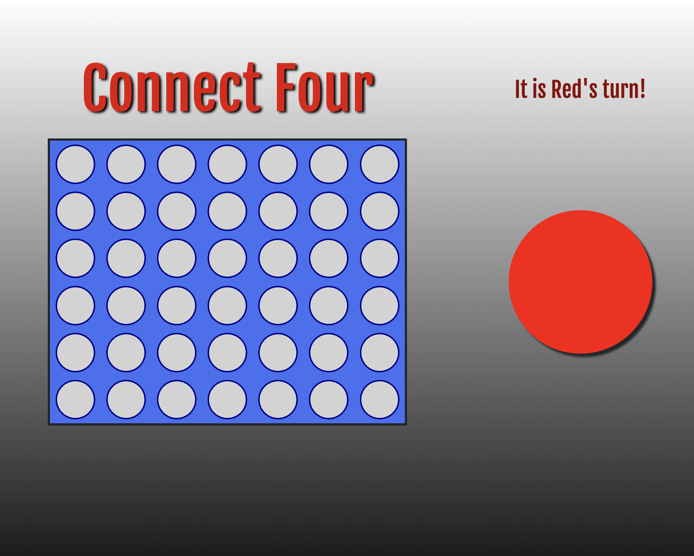
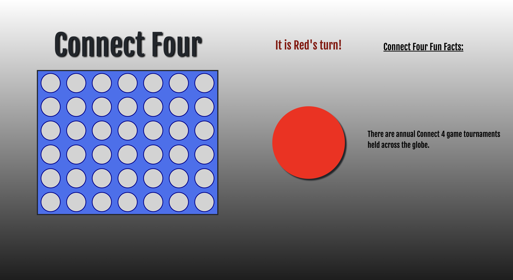

# Connect Four Unit 1 Project for SEIR 8/22

---

## Click [here](https://chris-elliott-connect-four.netlify.app/) to play the game.
---

### Goal of Game:

1.) Have a 6x7 board that will have cells to place tokens corresponding to a persons turn 

2.) One player will be red and the other will be black 

3.) When a player puts a token down in a given column the token will be drop to the bottom of the given column 

4.) A winner will be decided when a player has four of their tokens in a row whether that be diagonally, vertically or horizonatally

5.) When the game is over there will be a button that when clicked will allow the players to start a new game 

---
## PsuedoCode:

- Create a board in HTML with 42 possible spaces 
- Define the required variables used to track the state of the game (board, turn, winner)
- Store cached element references (each spot on grid, winning message and player turn, reset button)
- Add event listners and stub up the required functions that I will need to use for the game
- Create an initialized function (board will be empty, there will be no winner, and it will be player 1's turn)
- The game should be initialized with an empty board and grid for where to place the piece
- Create a render function to show what happens to the state of the game for a winner and what happens when a piece is placed on the board 
- The game state should change and render depending on what the user is doing 
- Handle a player clicking a square with an event listener that should place a piece at the bottom no matter how high the player chooses to click  
- Build the function to find and define a winner (this will require an array of winning combinations)
- Create Reset functionality for the reset button

---
## Prototype View:
### Wireframe of game:

---
## Screenshots of Game: 
### Minimum width of 786 pixels
 
### From 1100 pixels in width and on

---
## Technology Implemented: 
- Javascript
- CSS
- HTML
- GIT
- confetti.js
- Bootstrap 
- Google Fonts

---
## Credits

Win Audio from the one and only, Dj Khaled 

- Song - All I Do Is Win 

Golf Clap audio: 
  
- "https://www.youtube.com/watch?v=nNRvKviXbU0"

Schitts Creek Gif 
  
- "https://giphy.com/gifs/cbc-schitts-creek-4QFAH0qZ0LQnIwVYKT"

Fun Facts 
  
- https://www.gamesver.com/17-fun-and-intriguing-facts-about-connect-4/

Second Place Ribbon Image

- https://creazilla.com/nodes/70086-2nd-place-medal-clipart

---
## Future Next Steps:

- ~~Add audio for a winner and a tie~~
- Add a hard mode which will add a timer to each turn
- ~~Add a media query to add features if board reaches a limit~~ 
- ~~Add a second media query for a second limit to add new featrues~~ 
- ~~Add a data file that will have the fun facts which will randomly be displayed~~ 